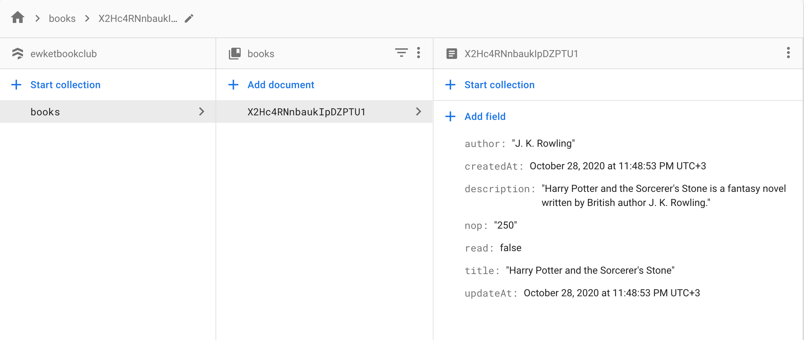

  <h1 align="center">Library Page</h1>

  

    This website allows the user to <strong>add</strong>, <strong>Delete</strong>, and set the <strong>read/unread</strong> status of books. We used the firebase firestore database to store the data. In this project, we used javascript DOM manipulation to dynamically shows the webpage depends on user activity.
  

### Built with

- HTML
- JavaScript
- Firebase firestore

## Setup and run the app

> Follow these steps to set up and run the quickstart:
  - Copy/Download this repo and open this folder in a Terminal.
  - Install the Firebase CLI if you do not have it installed on your machine:
  `npm -g i firebase-tools`
  - Create a Firebase project (watch until 1:11). You'll add the configuration later using firebase CLI
  > https://youtu.be/k1D0_wFlXgo?t=46
  - Add book collection to the firestore database. The following video introduces a firebase firestore.
  > https://www.youtube.com/watch?v=2Vf1D-rUMwE
  - Must use the following structure
  
  - Run firebase init on your terminal *be carefull don't overide files inside public*
  `firebase init`
  - Choose the _firestore_ and _hosting_ if you want to deploy this project
  - Finally run a local server:
  `firebase serve`
  - If you want to deploy the project run `firebase deploy`

### Live Demo

[Click here](https://ewketbookclub.web.app)

### Author

👤 **Ngenzi Herve**

- Github: [@muhenge](https://github.com/muhenge)

👤 **Abdulaziz Ali**

- Website [azizali.ml](https://azizali.ml/)
- Github: [@abredi](https://github.com/abredi)
- Twitter: [@rediabdulaziz](https://twitter.com/rediabdulaziz)
- Linkedin: [linkedin](https://www.linkedin.com/in/abdulaziz-ali-98948011a)

## 🤝 Contributing

Contributions, issues and feature requests are welcome!

Feel free to check the [issues page](https://github.com/muhenge/library-page/issues).

## Show your support

Give a ⭐️ if you like this project!

## Acknowledgments

- Odin Project
- Microverse